<!-- Library Logo -->


<!-- Buy me a cup of coffee -->
<a href='https://ko-fi.com/A406JCM' style='margin:13px;' target='_blank' align="right"></a>
<a href='https://play.google.com/store/apps/details?id=com.vansuita.pickimage.sample&pcampaignid=MKT-Other-global-all-co-prtnr-py-PartBadge-Mar2515-1' target='_blank' align="right"  style='margin:13px;'></a>
# PickImage


This is an [**Android**](https://developer.android.com) project. It shows a [DialogFragment](https://developer.android.com/reference/android/app/DialogFragment.html) with Camera or Gallery options. The user can choose from which provider wants to pick an image.

</br> 
</br> 
</br> 

<!-- JitPack integration -->
[](https://jitpack.io/#jrvansuita/PickImage)
[](https://android-arsenal.com/details/1/4614) [](https://www.uplabs.com/posts/pickimage) [](https://hits.seeyoufarm.com)

# Dialog screenshots

#### Default icons.
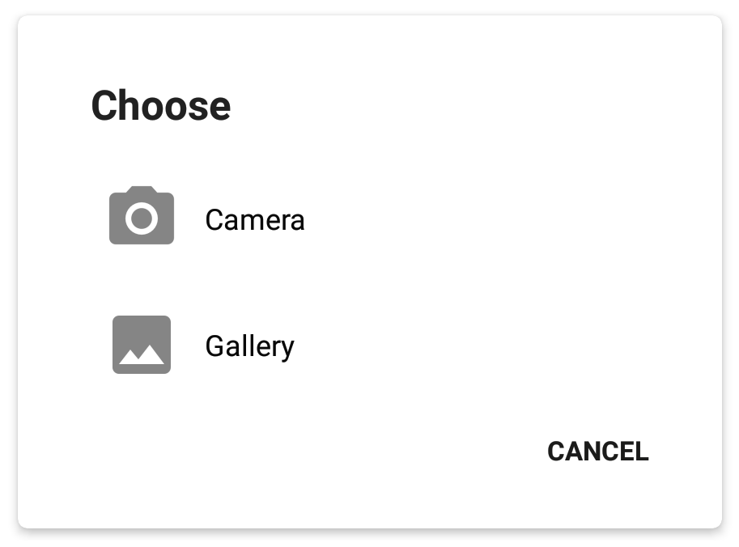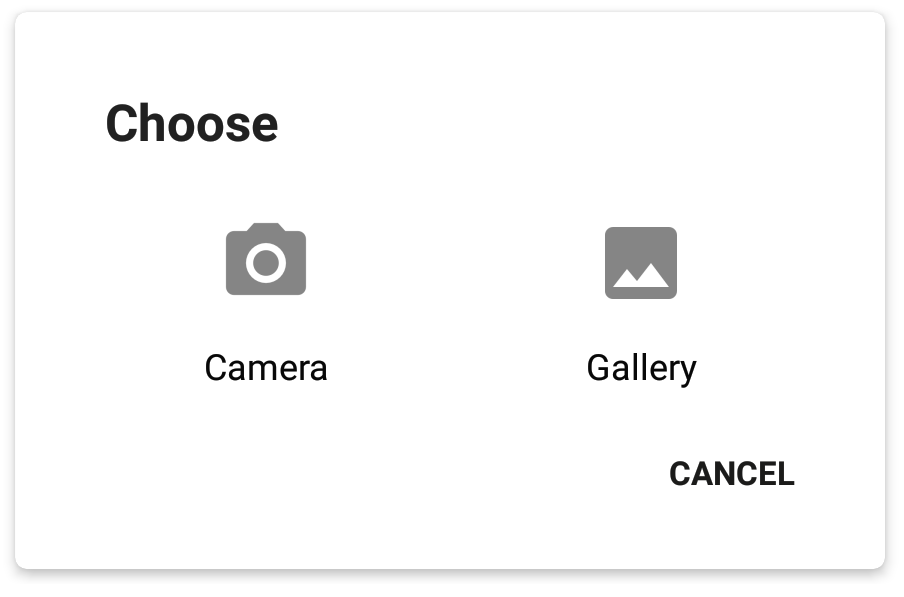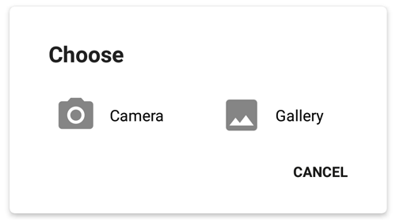

#### Colored icons.
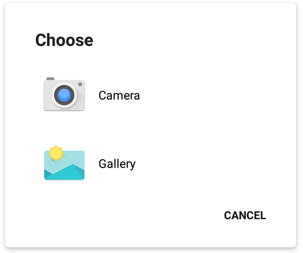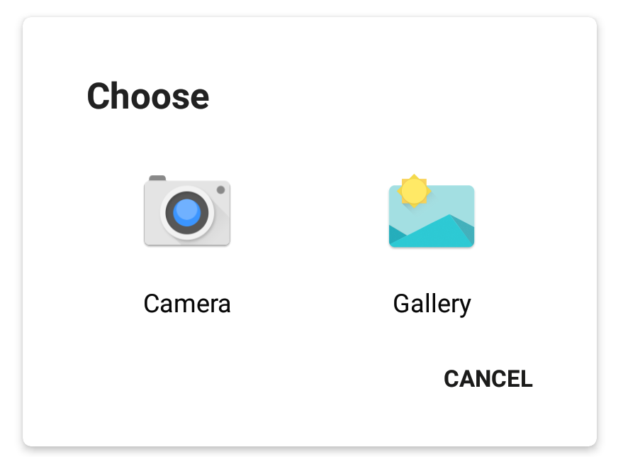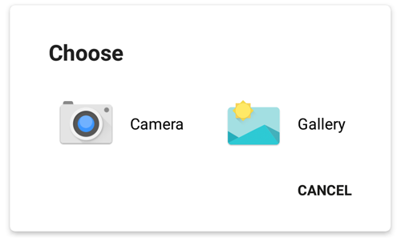

#### Custom dialog.
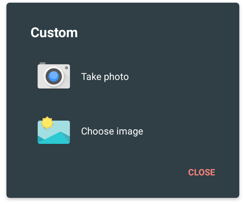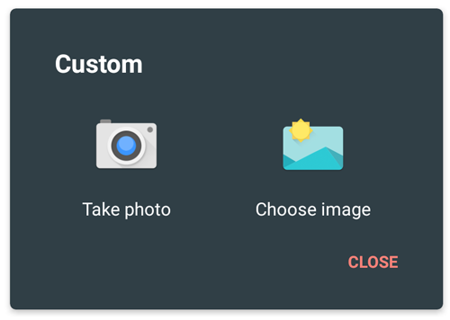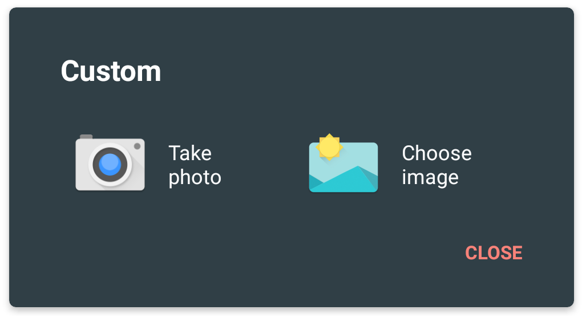

#### System dialog.
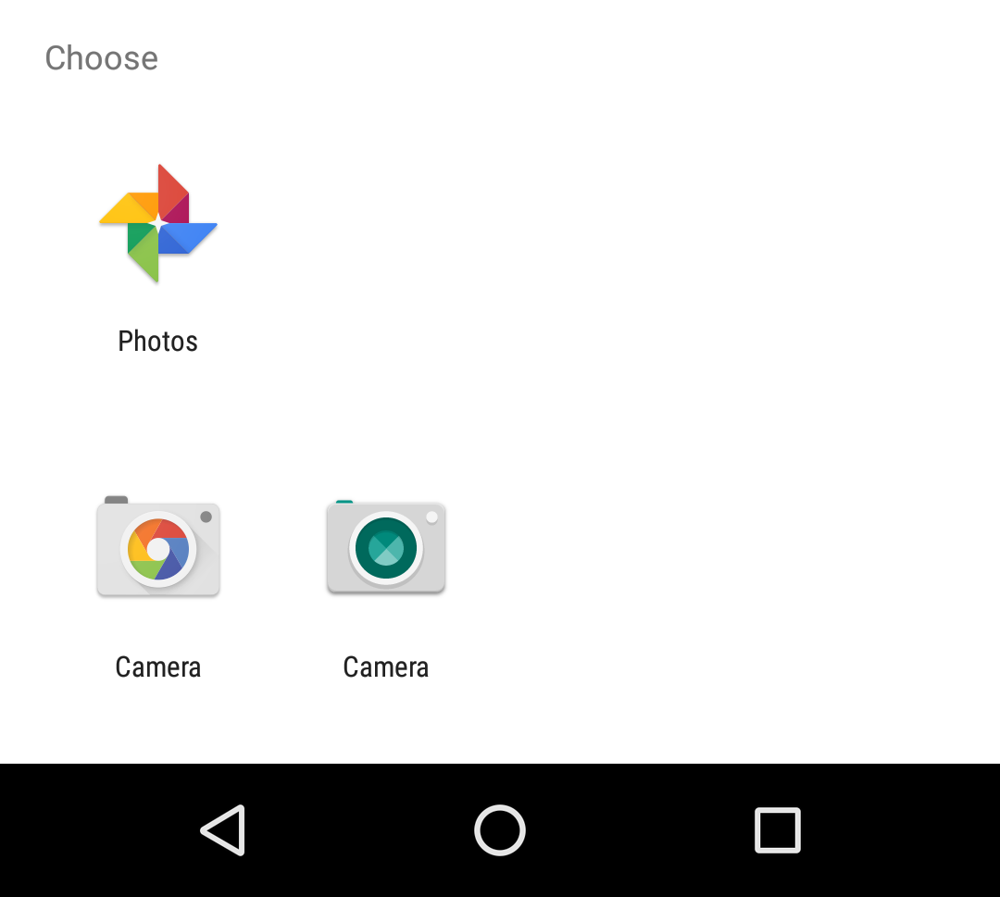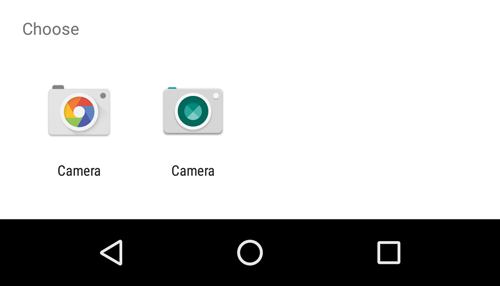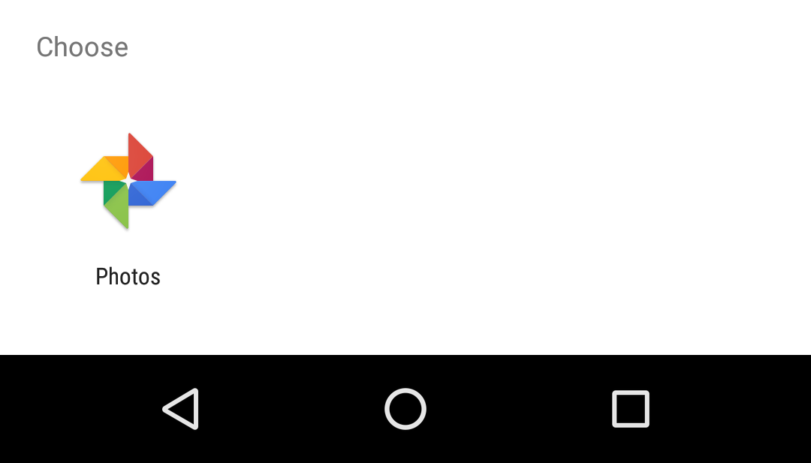

[](https://appetize.io/embed/91gknbry9vrtz281b7jy244e0m?device=nexus7&maxSize=50&autoplay=true&orientation=portrait&deviceColor=black) [](http://apk-dl.com/dl/com.vansuita.pickimage.sample)
 [](https://www.codacy.com/app/jrvansuita/PickImage?utm_source=github.com&amp;utm_medium=referral&amp;utm_content=jrvansuita/PickImage&amp;utm_campaign=Badge_Grade) <a target="_blank" href="https://developer.android.com/reference/android/os/Build.VERSION_CODES.html#GINGERBREAD"></a>
 
 
# Setup

#### Step #1. Add the JitPack repository to your build.gradle file:
```gradle
allprojects {
    repositories {
	maven { url "https://jitpack.io" }
    }
}
```
#### Step #1.1 Or add the JitPack repository to the settings.gradle file:

```gradle
dependencyResolutionManagement {
    repositoriesMode.set(RepositoriesMode.FAIL_ON_PROJECT_REPOS)
    repositories {
       maven { url 'https://jitpack.io' }
    }
}
```
     
#### Step #2. Add the dependency ([See latest release](https://jitpack.io/#jrvansuita/PickImage)).
```groovy
dependencies {
    implementation 'com.github.jrvansuita:PickImage:+'
}
```
# Implementation

#### Step #1. Overriding the library file provider authority to avoid installation conflicts.
The use of this library can cause [INSTALL_FAILED_CONFLICTING_PROVIDER](https://developer.android.com/guide/topics/manifest/provider-element.html#auth) if you skip this step. Update your AndroidManifest.xml with this exact provider declaration below.
```xml
<manifest ...>
    <application ...>
        <provider
            android:name="com.vansuita.pickimage.provider.PickImageFileProvider"
            android:authorities="${applicationId}.com.vansuita.pickimage.provider"
            android:exported="false"
            android:grantUriPermissions="true"
            tools:replace="android:authorities">
            <meta-data
                android:name="android.support.FILE_PROVIDER_PATHS"
                android:resource="@xml/picker_provider_paths" />
        </provider>
    </application>	
</manifest> 
```

#### Step #2 - Showing the dialog.
```java
PickImageDialog.build(new PickSetup()).show(this);
``` 
#### Step #3 - Applying the listeners.
##### Method #3.1 - Make your AppCompatActivity implements IPickResult.
```java
@Override
public void onPickResult(PickResult r) {
    if (r.getError() == null) {
        //If you want the Uri.
        //Mandatory to refresh image from Uri.
        //getImageView().setImageURI(null);

        //Setting the real returned image.
        //getImageView().setImageURI(r.getUri());

        //If you want the Bitmap.
        getImageView().setImageBitmap(r.getBitmap());

        //Image path
        //r.getPath();
    } else {
        //Handle possible errors
        //TODO: do what you have to do with r.getError();
        Toast.makeText(this, r.getError().getMessage(), Toast.LENGTH_LONG).show();
    }
}
```

##### Method #3.2 - Set the listener using the public method (Good for Fragments).

```java
PickImageDialog.build(new PickSetup())
               .setOnPickResult(new IPickResult() {
                  @Override
                  public void onPickResult(PickResult r) {
                     //TODO: do what you have to...
                  }
               })
	       .setOnPickCancel(new IPickCancel() {
		  @Override
		  public void onCancelClick() {
			//TODO: do what you have to if user clicked cancel
		   }
		}).show(getSupportFragmentManager());
```

#### Step #4 - Customize you Dialog using PickSetup.

```java
PickSetup setup = new PickSetup()
            .setTitle(yourText)
            .setTitleColor(yourColor)
            .setBackgroundColor(yourColor)
            .setProgressText(yourText)
            .setProgressTextColor(yourColor)
            .setCancelText(yourText)
            .setCancelTextColor(yourColor)
            .setButtonTextColor(yourColor)
            .setDimAmount(yourFloat)
            .setFlip(true)
            .setMaxSize
            .setPickTypes(EPickType.GALLERY, EPickType.CAMERA)
            .setCameraButtonText(yourText)
            .setGalleryButtonText(yourText)
            .setIconGravity(Gravity.LEFT)
            .setButtonOrientation(LinearLayoutCompat.VERTICAL)
            .setSystemDialog(false)
            .setGalleryIcon(yourIcon)
            .setCameraIcon(yourIcon)
            .setGalleryChooserTitle(yourText)
            .setCameraChooserTitle(yourText);
/*... and more to come. */
```

# Additionals

#### Own click implementations.
If you want to write your own button click event, just use [IPickClick](library/src/main/java/com/vansuita/pickimage/listeners/IPickClick.java) listener like in the example below. You may want to take a look at the sample app.
 
 ```java
 PickImageDialog.build(setup)
         .setOnClick(new IPickClick() {
             @Override
             public void onGalleryClick() {
                 Toast.makeText(SampleActivity.this, "Gallery Click!", Toast.LENGTH_LONG).show();
             }

             @Override
             public void onCameraClick() {
                 Toast.makeText(SampleActivity.this, "Camera Click!", Toast.LENGTH_LONG).show();
             }
          }).show(this);
``` 

#### For dismissing the dialog.

```java
PickImageDialog dialog = PickImageDialog.build(...);
dialog.dismiss();
```

#### Force a specific width and height.
```java
new PickSetup().setWidth(600).setHeight(800);
```

#### Not just an ImagePicker anymore! You can pick video too.
You can tell the setup to pick video instead of photo! (default option if you don't mention is to pick Image)
```java
new PickSetup().setVideo(true);
```
  
# Sample app code.
 You can take a look at the sample app [located on this project](/app/).
 
# 

<a href="https://www.instagram.com/jnrvans/" target="_blank">
  
</a>
<a href="https://github.com/jrvansuita" target="_blank">
  
</a>
<a href="https://play.google.com/store/apps/dev?id=8002078663318221363" target="_blank">
  
</a>
<a href="mailto:vansuita.jr@gmail.com" target="_blank" >
  
</a>
